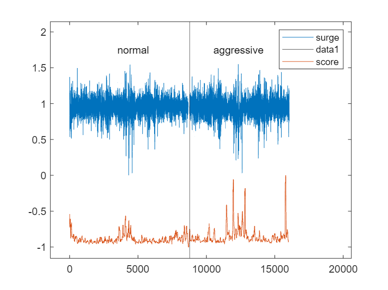
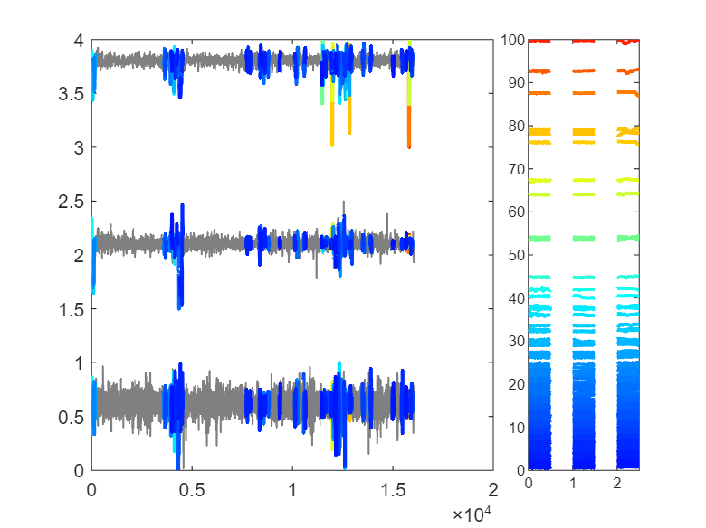
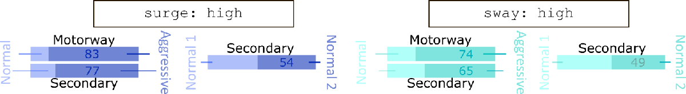

# *Quo*TS to search for higher level information

In this livescript we will give an example in how a single word can be used to distinguish between higher level classes of signals, namely normal and aggressive behavior while driving.

```matlab:Code
%load data
s_norm = load("datasets\example4\normal_motorway.txt");
s_aggressive = load("datasets\example4\aggressive_motorway.txt");

acc_x = [transpose(s_norm(:, 6)), mean(s_norm(:, 6))*ones(1, 100), transpose(s_aggressive(:, 6))];
acc_y = [transpose(s_norm(:, 7)), mean(s_norm(:, 7))*ones(1, 100), transpose(s_aggressive(:, 7))];
acc_z = [transpose(s_norm(:, 8)), mean(s_norm(:, 8))*ones(1, 100), transpose(s_aggressive(:, 8))];

X = [
    acc_x;
    acc_y;
    acc_z;
];
```

```matlab:Code
win_size = 50;
[W_1, W_2, W_3] = word_feature_extraction(X, win_size);
```

```text:Output
Warning: Integer operands are required for colon operator when used as index.
Warning: Integer operands are required for colon operator when used as index.
Warning: Integer operands are required for colon operator when used as index.
Warning: Integer operands are required for colon operator when used as index.
Warning: Integer operands are required for colon operator when used as index.
Warning: Integer operands are required for colon operator when used as index.
```

```matlab:Code
close all
score = query_search(X, W_1, W_2, W_3, "s3: high", win_size);

plot(X(1, :)/max(abs(X(1,:))) + 1, 'DisplayName', 'surge')
hold on
xline(8779)
plot(score - 1, 'DisplayName', 'score')
text(3500, 1.75, "normal")
text(10500, 1.75, "aggressive")
legend
```



```matlab:Code
close all
plotQuoTS(X, score, 100, win_size)
```



Frmo the 100 events searched, 29 events are from the *normal* behavior while 71 are from the aggressive behavior. We repeated the same approach to all drivers and road types of the public dataset, and found the following results:


