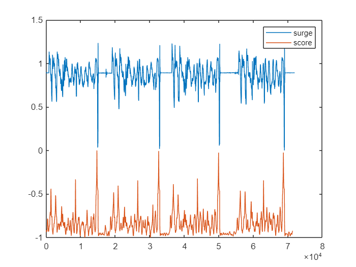
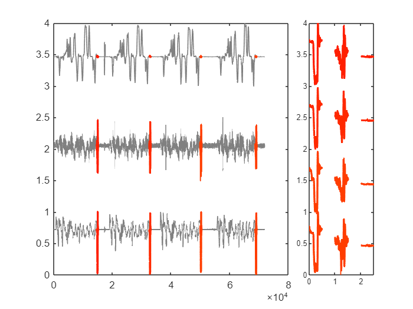
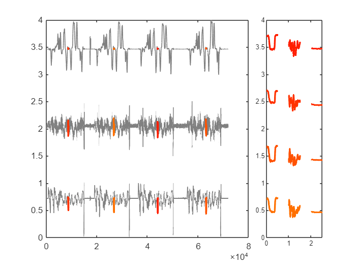
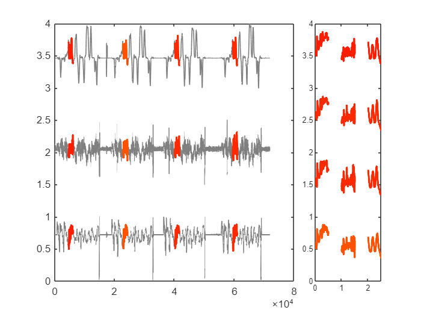
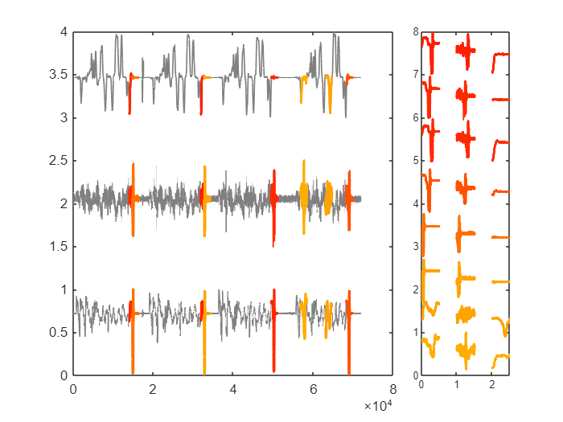
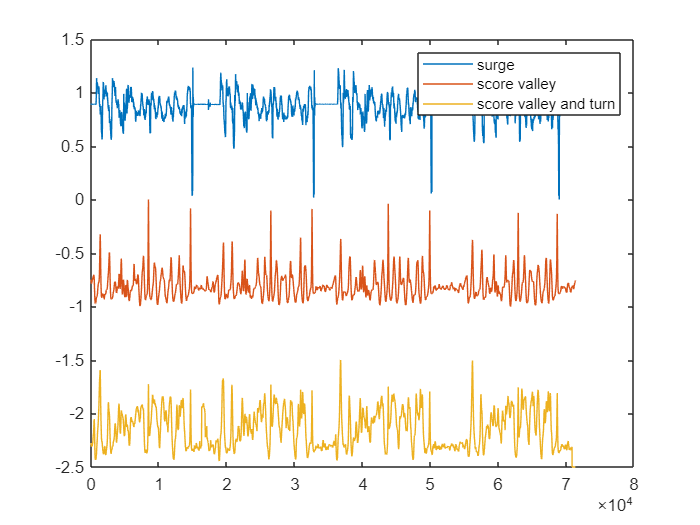
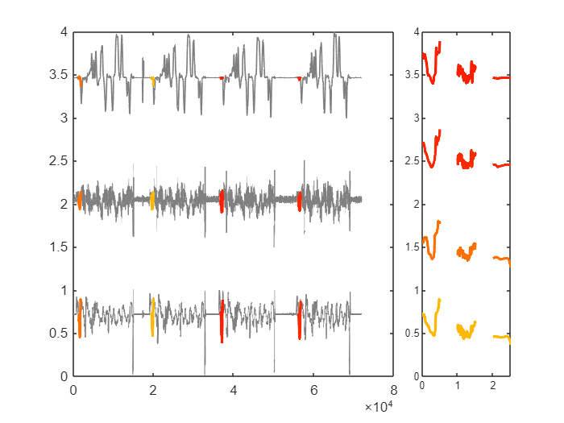

# *Quo*TS matches patterns as you describe them

In this livescript we will give some examples in how to use *Quo*TS in simple datasets from the automotive domain.

  
## Example 1 - Breaking
  

Breaking is a simple event to recognize in inertial data. It corresponds to a valley on the surge axis. Still, there are several different patterns in breaking, namely sudden break, rolling break, full stop, etc...

In this example, we show how to use simple queries to match them.

```matlab:Code
data_acc = load("datasets\Discrete_events_dataset\parking_lot_controlled_environment\opensignals_ANDROID_ACCELEROMETER_2022-02-12_11-29-16.txt");
data_gyr = load("datasets\Discrete_events_dataset\parking_lot_controlled_environment\opensignals_ANDROID_GYROSCOPE_2022-02-12_11-29-16.txt");

cut = 71870;

acc_y = transpose(movmean(data_acc(1:cut, 3), 10));
acc_z = transpose(movmean(data_acc(1:cut, 4), 10));
gyr_z = transpose(movmean(data_gyr(1:cut, 4), 10));

X = [acc_y; acc_z; gyr_z];
```

We begin by extracting word feature vectors from the signals.

```matlab:Code
win_size = 500;
[W_1, W_2, W_3] = word_feature_extraction(X, win_size);
```


After extracting word feature vectors, we have the necessary data to perform a search with each word available in our vocabulary. We will satart by detecting a *sudden break, * which is represented by having a sharp and high valley.

The result of our query is a a scoring function, that scores how well each subsequence matches the query we used:

```matlab:Code
close all
score = query_search(X, W_1, W_2, W_3, "s1: high valley", win_size);

plot(X(1, :)/max(abs(X(1,:))) + 1, 'DisplayName', 'surge')
hold on
plot(score - 1, 'DisplayName', 'score')
legend
```



As you can see, a peak on the score is found when the valley is higher. It sums the contributions of both valley and high.

```matlab:Code
close all
plotQuoTS(X, score, 4, win_size)
```



## Example 2 - Rolling Stop

Another type of stop is the rolling stop. It is described as being shorter than a full stop and thinner. We will use a smaller time window to search for this pattern, which will be described by vval (v-shaped valley).

```matlab:Code
win_size = 250;
[W_1, W_2, W_3] = word_feature_extraction(X, win_size);
```

```text:Output
Warning: Integer operands are required for colon operator when used as index.
Warning: Integer operands are required for colon operator when used as index.
Warning: Integer operands are required for colon operator when used as index.
Warning: Integer operands are required for colon operator when used as index.
Warning: Integer operands are required for colon operator when used as index.
Warning: Integer operands are required for colon operator when used as index.
```

```matlab:Code
close all
score2 = query_search(X, W_1, W_2, W_3, "s1: vval", win_size);
```

```matlab:Code
close all
plotQuoTS(X, score2, 4, win_size)
```



## Example 3 - 3 Pointer

A 3-pointer is a sequence of actions taken by the driver to turn invert the sway. Usually, 3 turns are enough to make this inversion when doing it to the left: sway left, sway backward left and sway left. This represents 3 followed peaks on the sway axis. We match these in a larger time scale.

```matlab:Code
win_size = 1500;
[W_1, W_2, W_3] = word_feature_extraction(X, win_size);
```

```text:Output
Warning: Integer operands are required for colon operator when used as index.
Warning: Integer operands are required for colon operator when used as index.
Warning: Integer operands are required for colon operator when used as index.
Warning: Integer operands are required for colon operator when used as index.
Warning: Integer operands are required for colon operator when used as index.
Warning: Integer operands are required for colon operator when used as index.
Warning: Integer operands are required for colon operator when used as index.
Warning: Integer operands are required for colon operator when used as index.
Warning: Integer operands are required for colon operator when used as index.
Warning: Integer operands are required for colon operator when used as index.
Warning: Integer operands are required for colon operator when used as index.
Warning: Integer operands are required for colon operator when used as index.
```

```matlab:Code
score3 = query_search(X, W_1, W_2, W_3, "s3: [peak peak peak]", win_size);
```

```matlab:Code
close all
plotQuoTS(X, score3, 4, win_size)
```



## Example 4 - Full Legal Stop

We showed an example of a sudden stop, a rolling stop, but not a full stop. The latter has a deaceleration that is typically longer than the acceleration phase. Besides, to distinguish it from the other valleys that are more significant, we have to make clear that we want a valley that is closer to the average of the signal.

```matlab:Code
win_size = 1500;
[W_1, W_2, W_3] = word_feature_extraction(X, win_size);
```

```text:Output
Warning: Integer operands are required for colon operator when used as index.
Warning: Integer operands are required for colon operator when used as index.
Warning: Integer operands are required for colon operator when used as index.
Warning: Integer operands are required for colon operator when used as index.
Warning: Integer operands are required for colon operator when used as index.
Warning: Integer operands are required for colon operator when used as index.
Warning: Integer operands are required for colon operator when used as index.
Warning: Integer operands are required for colon operator when used as index.
Warning: Integer operands are required for colon operator when used as index.
Warning: Integer operands are required for colon operator when used as index.
Warning: Integer operands are required for colon operator when used as index.
Warning: Integer operands are required for colon operator when used as index.
```

```matlab:Code
score4 = query_search(X, W_1, W_2, W_3, "s1: [down down up] middle", win_size);
```

```matlab:Code
close all
plotQuoTS(X, score4, 8, win_size)
```



## Example 5 - Stop and Turn

While driving, we have sequential actions, which are ordered in time. For instance, we may stop before turning, or we may decelerate while turning. In any case, we have an operator that helps in searching for sequential patterns, even if these belong to different dimensions of the signal. Here we show the detection of the subject stopping before turning right.

The pattern for stopping is "Valley" on surge, while the pattern for turning right is "Valley" on sway.

```matlab:Code
score5_1 = query_search(X, W_1, W_2, W_3, "s1: valley", win_size);
score5_2 = query_search(X, W_1, W_2, W_3, "s1: valley followed by s3: high valley", win_size);

close all
plot(X(1, :)/max(abs(X(1,:))) + 1, 'DisplayName', 'surge')
hold on
plot(score5_1 - 1, 'DisplayName', 'score valley')
plot(score5_2 - 2.5, 'DisplayName', 'score valley and turn')
legend
```



To be sure, we tested two queries, and can see that if using only "valley", we are not able to search for the right event. Only when using *followed by* we are able to maximize the valley that we expect.

```matlab:Code
close all
plotQuoTS(X, score5_2, 4, win_size)
```


