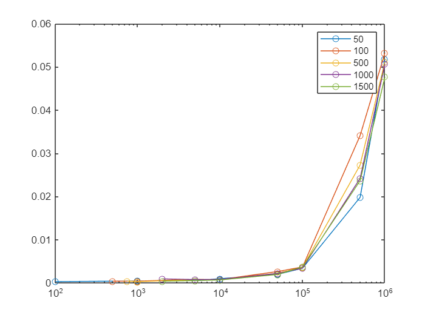

## Speed performance in query matching for *Quo*TS
  

We searched for how long it takes to make a search with  QuoTS in increasingly longer datasets. Here are oiur expriments

```matlab:Code
close all
%signal
data_gyr = load("datasets\Discrete_events_dataset\parking_lot_controlled_environment\opensignals_ANDROID_GYROSCOPE_2022-02-12_11-29-16.txt");
data_acc = load("datasets\Discrete_events_dataset\parking_lot_controlled_environment\opensignals_ANDROID_ACCELEROMETER_2022-02-12_11-29-16.txt");

acc_y = transpose(movmean(data_acc(:, 3), 10));
acc_z = transpose(movmean(data_acc(:, 4), 10));
gyr_z = transpose(movmean(data_gyr(:, 4), 10));

for i = 1:5
    acc_y = [acc_y acc_y];
    acc_z = [acc_z acc_z];
    gyr_z = [gyr_z gyr_z];
end
```

```matlab:Code
win_size = 50;
sizes = [2000, 5000, 10000, 50000, 100000, 500000, 1000000];
queries = ["s1: high valley", "s1: vval middle", "s3: [peak peak peak]", "s1: [down down up] middle", "s1: valley followed by s3: high valley"];

speed_ = [];
for s_i = sizes
    s_i
    acc1 = acc_y(1:s_i);
    acc2 = acc_z(1:s_i);
    gyr1 = gyr_z(1:s_i);
    
    X = [acc1; acc2; gyr1];
    [W_1, W_2, W_3] = word_feature_extraction(X, win_size);
    
    speed_q = 0;
    for q_i = queries
        speed_i = 0;
        for i = 1:10
            tic
            score = query_search(X, W_1, W_2, W_3, q_i, 1000);
            t = toc;
            speed_i = speed_i+t;
        end
        speed_q = speed_q + speed_i/10;
    end
    speed_ = [speed_ speed_q/length(queries)];
end
```

```text:Output
s_i = 2000
s_i = 5000
s_i = 10000
s_i = 50000
s_i = 100000
s_i = 500000
s_i = 1000000
```

```matlab:Code
sizes50 = [100, 1000, 5000, 10000, 50000, 100000, 500000, 1000000];
speed50 = [2.875520000000001e-04,4.390200000000000e-04,5.478440000000000e-04,9.728360000000000e-04,0.001977194000000,0.003388664000000,0.019795552000000,0.051837722000000];

sizes100 = [500, 1000, 5000, 10000, 50000, 100000, 500000, 1000000];
speed100 = [3.849139999999999e-04,3.922820000000000e-04,8.224440000000001e-04,7.684380000000000e-04,0.002626548000000,0.003675924000000,0.034095544000000,0.053241600000000];

sizes500 = [750, 1000, 5000, 10000, 50000, 100000, 500000, 1000000];
speed500 = [3.985340000000000e-04,2.739060000000000e-04,7.799120000000000e-04,8.129640000000000e-04,0.002230930000000,0.003584154000000,0.027272792000000,0.051152888000000];

sizes1000 = [2000, 5000, 10000, 50000, 100000, 500000, 1000000];
speed1000 = [9.176819999999999e-04,7.731360000000001e-04,8.088020000000000e-04,0.002179638000000,0.003400742000000,0.024202682000000,0.050661394000000];

sizes1500 = [2000, 5000, 10000, 50000, 100000, 500000, 1000000];
speed1500 = [3.878480000000000e-04,5.222940000000000e-04,6.783280000000000e-04,0.001948704000000,0.003696846000000,0.023643888000000,0.047669526000000];

close all
semilogx(sizes50, speed50, 'Marker', 'o', 'DisplayName', '50')
hold on
semilogx(sizes100, speed100, 'Marker', 'o', 'DisplayName', '100')
semilogx(sizes500, speed500, 'Marker', 'o', 'DisplayName', '500')
semilogx(sizes1000, speed1000, 'Marker', 'o', 'DisplayName', '1000')
semilogx(sizes1500, speed1500, 'Marker', 'o', 'DisplayName', '1500')

legend
```



```matlab:Code

```
