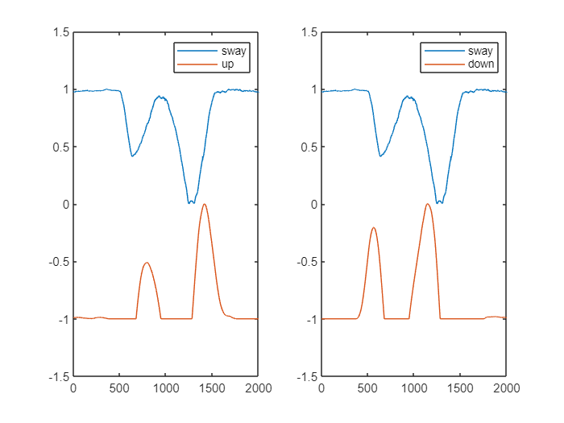
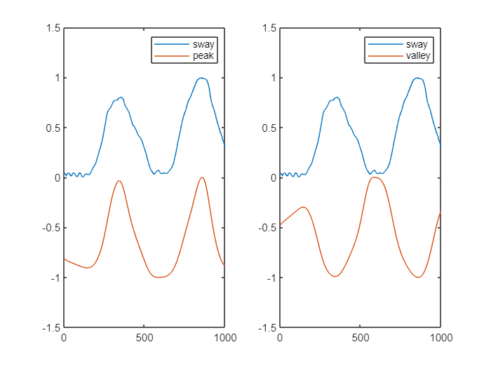
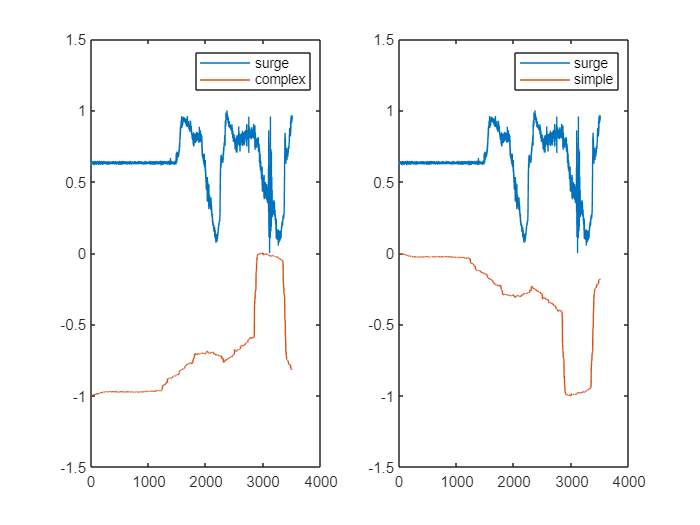
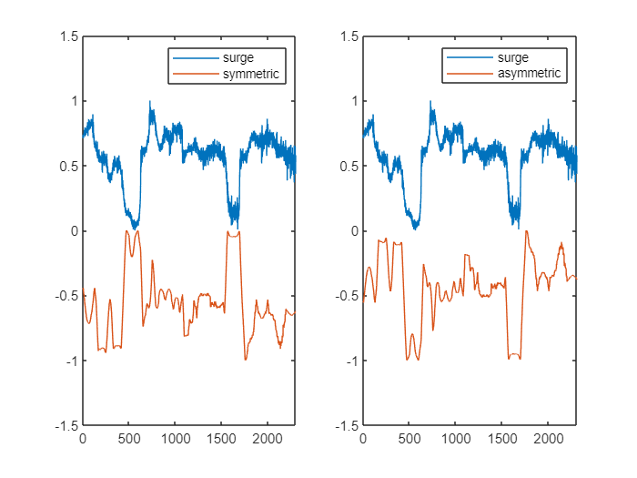
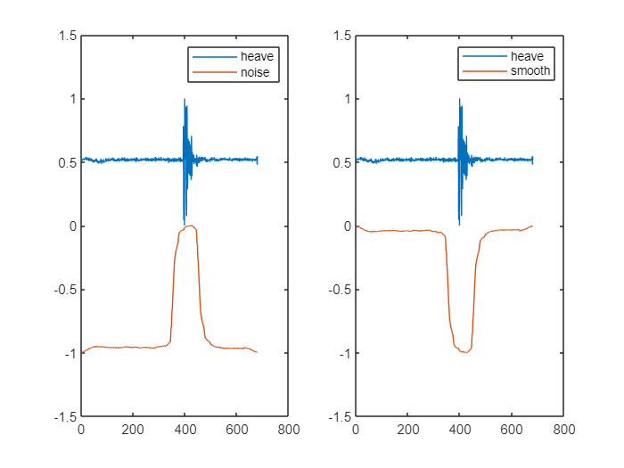
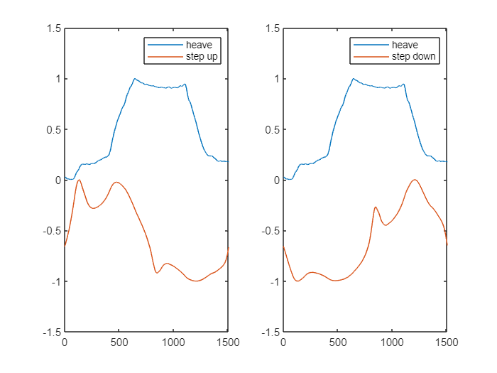
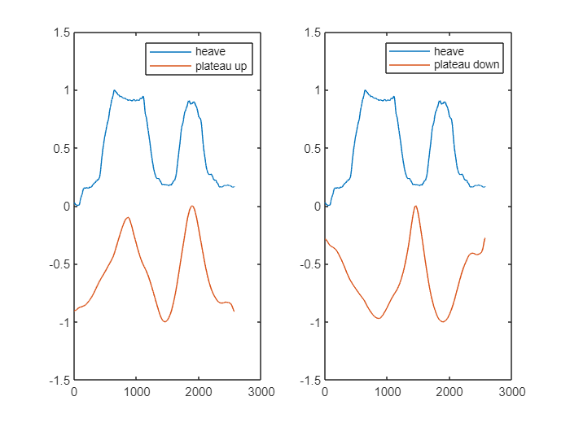
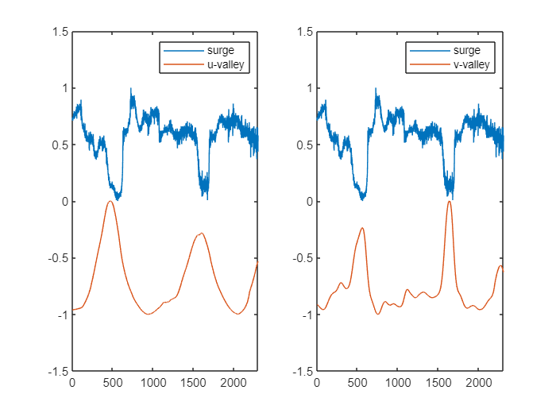
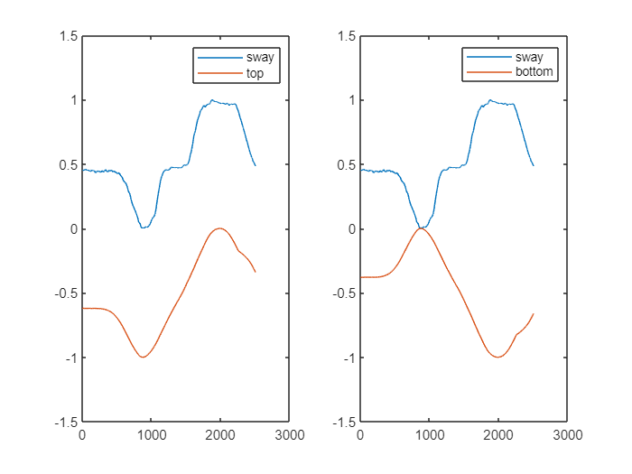
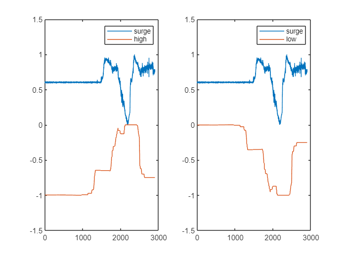

# Word Feature Vectors

In this document, we show how each word feature vector that we generated matches to a specific example. 

  
### WFV 1 - Up and Down

The slope estimation of a linear adjustment (*y= ax + b) *to the *subsequence*, being `up `(`down`) = m, if a<sub>up>0 (a<sub>down<0) or `up `(`down`) = 0, if a<sub>up<=0 (a<sub>down=0).

```matlab:Code
close all
%signal
sig_gyr = load("datasets\Discrete_events_dataset\parking_lot_controlled_environment\opensignals_ANDROID_GYROSCOPE_2022-02-12_11-29-16.txt");
sig_acc = load("datasets\Discrete_events_dataset\parking_lot_controlled_environment\opensignals_ANDROID_ACCELEROMETER_2022-02-12_11-29-16.txt");
```

```matlab:Code
close all
sig = transpose(sig_gyr(48000:50000, 4));
%up_down feature code
win_size = 250;
half_win_size = fix(win_size/2);

mirrored_sig = [sig(1)*ones(1, half_win_size), sig, sig(end)*ones(1, half_win_size)];
mirror_sig_mat = buffer(mirrored_sig, win_size, win_size-1, 'nodelay');
mirror_sig_mat = mirror_sig_mat(:, 1:length(sig));

x_mat = [ones(win_size, 1), transpose(linspace(1, win_size, win_size))];
    
slopes_ = x_mat\mirror_sig_mat;
slopes_ = slopes_(2, :);

moving_up = max(slopes_, 0);
moving_down = abs(min(slopes_, 0));

%representation
subplot(1,2,1)
plot(norm_1_sig(sig), 'DisplayName','sway')
hold on
plot(norm_1_sig(moving_up) - 1, 'DisplayName','up')
ylim([-1.5, 1.5])
legend
subplot(1,2,2)
plot(norm_1_sig(sig), 'DisplayName','sway')
hold on
plot(norm_1_sig(moving_down)-1,'DisplayName','down')
ylim([-1.5, 1.5])
legend
```



### WFV 2 - Peak and Valley

The logarithmic MASS distance to the template of a peak (valley), modulated by a gaussian function.

```matlab:Code
close all
win_size = 500;
half_win_size = fix(win_size/2);
sig = transpose(sig_gyr(23000:24000, 4));
sig_ = [sig(1)*ones(1,half_win_size), sig, sig(end)*ones(1,half_win_size)];
a = 1;
b = 0;
c = 0.1;
x = linspace(-1, 1, win_size);
query_peak = a*exp(((x-b).^2)/(-2*(c^2)));
query_valley = -a*exp(((x-b).^2)/(-2*(c^2)));
mass_peak = log10(MASS_V2(sig_, query_peak));
mass_peak = max(mass_peak) - mass_peak(1:length(sig));
mass_val = log10(MASS_V2(sig_, query_valley));
mass_val = max(mass_val) - mass_val(1:length(sig));

subplot(1,2,1)
plot(norm_1_sig(sig), 'DisplayName','sway')
hold on
plot(norm_1_sig(mass_peak)-1, 'DisplayName','peak')
ylim([-1.5, 1.5])
legend
subplot(1,2,2)
plot(norm_1_sig(sig), 'DisplayName','sway')
hold on
plot(norm_1_sig(mass_val)-1,'DisplayName','valley')
ylim([-1.5, 1.5])
legend
```



### WFV 3 - Complex and simple

A complexity-invariant distance measure of the *subsequence.*

```matlab:Code
close all
sig = transpose(sig_acc(73500:77000, 3));

win_size = 500;
half_win_size = fix(win_size/2);

mirrored_sig = [sig(1)*ones(1, half_win_size), sig, sig(end)*ones(1, half_win_size)];
mirror_sig_mat = buffer(mirrored_sig, win_size, win_size-1, 'nodelay');
mirror_sig_mat = mirror_sig_mat(:, 1:length(sig));

moving_complexity = sqrt(movsum(diff(sig).^2, win_size));
moving_complexity = [moving_complexity, moving_complexity(end)];
moving_simple = max(moving_complexity) - moving_complexity;

subplot(1,2,1)
plot(norm_1_sig(sig), 'DisplayName','surge')
hold on
plot(norm_1_sig(moving_complexity)-1, 'DisplayName','complex')
ylim([-1.5, 1.5])
legend
subplot(1,2,2)
plot(norm_1_sig(sig), 'DisplayName','surge')
hold on
plot(norm_1_sig(moving_simple)-1,'DisplayName','simple')
ylim([-1.5, 1.5])
legend
```



### WFV 4 - Symmetric and Asymmetric

The MASS distance to the *subsequence*’s horizontally flipped self. 

```matlab:Code
close all

sig = [transpose(sig_acc(1068:2143, 3)), transpose(sig_acc(8157:9385,3))];
win_size = 250;
half_win_size = fix(win_size/2);
mirrored_sig = [sig(1)*ones(1, win_size), sig, sig(end)*ones(1, win_size+half_win_size)];

moving_asymmetry = zeros(1, length(sig));
%slide windown along signal
for i = win_size:length(sig)+win_size-1
    sec_mirrored_sig = mirrored_sig(i-half_win_size+1:i+half_win_size);
    sig2search_symmetry = mirrored_sig(i-win_size+1:i+win_size);

    %Symmetry--------------------------------------------------------------------------
    moving_asymmetry(i-win_size+1) = symmetry_estimation(sig2search_symmetry, fliplr(sec_mirrored_sig));
end

moving_symmetry = max(moving_asymmetry)-moving_asymmetry;

subplot(1,2,1)
plot(norm_1_sig(sig), 'DisplayName','surge')
hold on
plot(norm_1_sig(moving_symmetry)-1, 'DisplayName','symmetric')
ylim([-1.5, 1.5])
legend
subplot(1,2,2)
plot(norm_1_sig(sig), 'DisplayName','surge')
hold on
plot(norm_1_sig(moving_asymmetry)-1,'DisplayName','asymmetric')
ylim([-1.5, 1.5])
legend
```



### WFV 5 - noise (smooth)

The residual error when modeled by a moving average

```matlab:Code
close all

sig = transpose(sig_gyr(115451:116129, 3));
win_size = 100;

half_win_size = fix(win_size/2);
mirrored_sig = [sig(1)*ones(1, win_size), sig, sig(end)*ones(1, win_size+half_win_size)];

moving_noise = movsum(abs(sig - movmean(sig, half_win_size)), win_size);
moving_smooth = max(moving_noise) - moving_noise;

subplot(1,2,1)
plot(norm_1_sig(sig), 'DisplayName','heave')
hold on
plot(norm_1_sig(moving_noise)-1, 'DisplayName','noise')
ylim([-1.5, 1.5])
legend
subplot(1,2,2)
plot(norm_1_sig(sig), 'DisplayName','heave')
hold on
plot(norm_1_sig(moving_smooth)-1,'DisplayName','smooth')
ylim([-1.5, 1.5])
legend
```



### WFV 6 - stepup and stepdown

The logarithmic MASS distance to the template of a step-up(down) function

```matlab:Code
close all
sig = transpose(sig_gyr(64432:65940, 4));
win_size = 500;
half_win_size = fix(win_size/2);
sig_ = [fliplr(sig(1:half_win_size)), sig, fliplr(sig(end-half_win_size:end))];

pos_step_query = zeros(1, win_size);
neg_step_query = zeros(1, win_size);

pos_step_query(win_size/2:end) = 1;
neg_step_query(win_size/2:end) = -1;

pos_step = MASS_V2(sig_, pos_step_query);
pos_step = max(pos_step) - pos_step(1:length(sig));
neg_step = MASS_V2(sig_, neg_step_query);
neg_step = max(neg_step) - neg_step(1:length(sig));

subplot(1,2,1)
plot(norm_1_sig(sig), 'DisplayName','heave')
hold on
plot(norm_1_sig(pos_step)-1, 'DisplayName','step up')
ylim([-1.5, 1.5])
legend
subplot(1,2,2)
plot(norm_1_sig(sig), 'DisplayName','heave')
hold on
plot(norm_1_sig(neg_step)-1,'DisplayName','step down')
ylim([-1.5, 1.5])
legend
```



### WFV 7 - plateau up (down)

The logarithmic MASS distance to the template of a *plateau*-up(down) function

```matlab:Code
close all
sig = transpose(sig_gyr(64432:67000, 4));
win_size = 1000;
half_win_size = fix(win_size/2);
sig_ = [fliplr(sig(1:half_win_size)), sig, fliplr(sig(end-half_win_size:end))];

pos_plat_query = zeros(1, win_size);
neg_plat_query = zeros(1, win_size);

pos_plat_query(win_size/4:3*win_size/4) = 1;
neg_plat_query(win_size/4:3*win_size/4) = -1;

pos_plateau = MASS_V2(sig_, pos_plat_query);
pos_plateau = max(pos_plateau) - pos_plateau(1:length(sig));
neg_plateau = MASS_V2(sig_, neg_plat_query);
neg_plateau = max(neg_plateau) - neg_plateau(1:length(sig));

subplot(1,2,1)
plot(norm_1_sig(sig), 'DisplayName','heave')
hold on
plot(norm_1_sig(pos_plateau)-1, 'DisplayName','plateau up')
ylim([-1.5, 1.5])
legend
subplot(1,2,2)
plot(norm_1_sig(sig), 'DisplayName','heave')
hold on
plot(norm_1_sig(neg_plateau)-1,'DisplayName','plateau down')
ylim([-1.5, 1.5])
legend
```



### WFV 8 - u-shaped valley and v-shaped valley

The logarithmic MASS distance to the template of a *U-shaped *(*V-shaped) *valley function.

```matlab:Code
close all
sig = [transpose(sig_acc(1068:2143, 3)), transpose(sig_acc(8157:9385,3))];
win_size = 1000;

half_win_size = fix(win_size/2);
sig_ = [sig(1)*ones(1, half_win_size), sig, sig(end)*ones(1, half_win_size)];

a = 1;
b = 0;
x = linspace(-1, 1, win_size);
valley_ = -a*exp(((x-b).^2)/(-2*(0.5^2)));
mass_u_valley = log(log(MASS_V2(sig_, valley_)));
mass_u_valley(isinf(mass_u_valley)) = max(mass_u_valley(~isinf(mass_u_valley)));
mass_u_valley(isnan(mass_u_valley)) = max(mass_u_valley(~isnan(mass_u_valley)));
mass_u_valley = max(mass_u_valley) - mass_u_valley(1:length(sig));

valley_ = -a*exp(((x-b).^2)/(-2*(0.05^2)));
mass_v_valley = log(MASS_V2(sig_, valley_));
mass_v_valley(isinf(mass_v_valley)) = max(mass_v_valley(~isinf(mass_v_valley)));
mass_v_valley(isnan(mass_v_valley)) = max(mass_v_valley(~isnan(mass_v_valley)));
mass_v_valley = max(mass_v_valley) - mass_v_valley(1:length(sig));

subplot(1,2,1)
plot(norm_1_sig(sig), 'DisplayName','surge')
hold on
plot(norm_1_sig(mass_u_valley)-1, 'DisplayName','u-valley')
ylim([-1.5, 1.5])
legend
subplot(1,2,2)
plot(norm_1_sig(sig), 'DisplayName','surge')
hold on
plot(norm_1_sig(mass_v_valley)-1,'DisplayName','v-valley')
ylim([-1.5, 1.5])
legend
```



### WFV 9 - Top (Bottom)

The moving average of the time series

```matlab:Code
close all
sig = transpose(sig_gyr(8885:11389, 4));
win_size = 500;

half_win_size = fix(win_size/2);
sig_ = [sig(1)*ones(1, half_win_size), sig, sig(end)*ones(1, half_win_size)];

top = movmean(sig, win_size);
bottom = max(top) - top;

subplot(1,2,1)
plot(norm_1_sig(sig), 'DisplayName','sway')
hold on
plot(norm_1_sig(top)-1, 'DisplayName','top')
ylim([-1.5, 1.5])
legend
subplot(1,2,2)
plot(norm_1_sig(sig), 'DisplayName','sway')
hold on
plot(norm_1_sig(bottom)-1,'DisplayName','bottom')
ylim([-1.5, 1.5])
legend
```



### WFV 10 - High (Low)

The difference between the maximum and minimum value of a *subsequence*

```matlab:Code
close all
sig = transpose(sig_acc(73500:76400, 3));

win_size = 500;

high = movmax(sig, win_size) - movmin(sig, win_size);
low = max(high) - high;

subplot(1,2,1)
plot(norm_1_sig(sig), 'DisplayName','surge')
hold on
plot(norm_1_sig(high)-1, 'DisplayName','high')
ylim([-1.5, 1.5])
legend
subplot(1,2,2)
plot(norm_1_sig(sig), 'DisplayName','surge')
hold on
plot(norm_1_sig(low)-1,'DisplayName','low')
ylim([-1.5, 1.5])
legend
```



### WFV 11 - Uncommon (Common)

The matrix profile of the time series

```matlab:Code
% close all
% sig = transpose(sig_acc(73500:77000, 3));
% 
% win_size = 1000;
% 
% half_win_size = fix(win_size/2);
% sig_ = [sig(1)*ones(1, half_win_size), sig, sig(end)*ones(1, half_win_size)];
% 
% [uncommon, ~] = mstamp(transpose(sig_), fix(win_size), [], []);
% uncommon = norm_1_sig(transpose(uncommon));
% common = 1 - uncommon;
% 
% subplot(1,2,1)
% plot(sig/(max(sig)-min(sig)), 'DisplayName','surge')
% hold on
% plot(uncommon, 'DisplayName','uncommon')
% ylim([-1.5, 1.5])
% legend
% subplot(1,2,2)
% plot(sig/(max(sig)-min(sig)), 'DisplayName','surge')
% hold on
% plot(common,'DisplayName','common')
% ylim([-1.5, 1.5])
% legend
```

  

```matlab:Code
function symmetry = symmetry_estimation(sig2search, query)
    %Search minimum of left matrix profile over the fliped signal.
    %The lower the value, the higher is the symmetry.
    mass_distance = MASS_V2(sig2search, query);
    if(isnan(min(mass_distance)))
        symmetry = 0;
    else
        symmetry = real(min(mass_distance));
    end
end

function norm_sig = norm_1_sig(s)
    if(max(s)==min(s))
        norm_sig = zeros(1, length(s));
    else
        norm_sig = (s - min(s))/(max(s)-min(s));
    end
end
```
